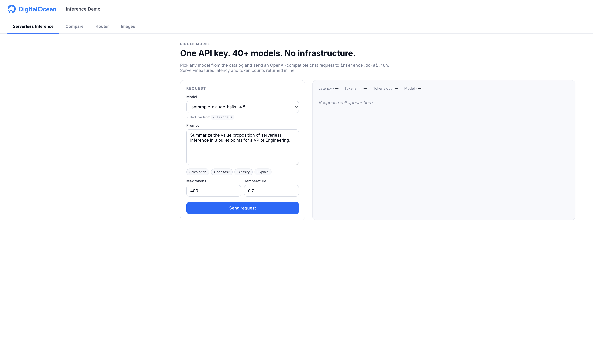
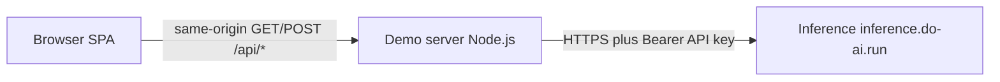

# DO Inference Demo

A simple browser demo of the DigitalOcean Inference API. Single Node.js server (no dependencies — stdlib only) plus a static HTML/JS frontend. Designed for live walkthroughs of chat, multi-model comparison, routing, and image generation against `inference.do-ai.run`.



## What it shows

- **Single chat** — pick any model from the catalog and send an OpenAI-compatible chat request. Server-measured latency and token counts inline.
- **Compare** — fan out one prompt to N models in parallel, side-by-side results, fastest highlighted.
- **Router** — preset prompts walk through the router's task classes (summarization, code, reasoning, etc.) and show which downstream model it picked.
- **Image** — generate images through the same endpoint at `/v1/images/generations`.

## Requirements

- Node.js >= 20 (uses `--env-file` and the global `fetch`)
- A DigitalOcean Inference API key

## Setup

```sh
cp .env.example .env
# edit .env: DO_INFERENCE_KEY and DEFAULT_ROUTER (required for Inference)
# optional: set PAGE_ACCESS_PASSWORD to require an unlock password for this deployment
npm start
```

The server listens on `http://localhost:3000` by default.

`.env` is optional — if it isn't present, the server reads the same variables straight from the environment. Exporting them in your shell, container, or deployment platform works too:

```sh
DO_INFERENCE_KEY=sk-do-... DEFAULT_ROUTER=router:your-router-name npm start
```

When both are set, real environment variables take precedence over values in `.env`.

## Configuration

Inference credentials and a few runtime options are read from the environment (or `.env`). Everything else (base URL, paths, model lists, UI defaults, branding) lives as inline constants in `server.js` so the demo runs with minimal setup.

| Variable | Required | Description |
|---|---|---|
| `DO_INFERENCE_KEY` | yes | Your DigitalOcean Inference API key. |
| `DEFAULT_ROUTER` | recommended | Router model identifier shown in the Router tab (e.g. `router:your-router-name`). |
| `PAGE_ACCESS_PASSWORD` | no | If **non-empty** (after trimming), enables a **page gate**: the UI shows a password screen on cold load, and proxied routes (`/api/models`, `/api/chat`, `/api/compare`, `/api/image`) require `Authorization: Bearer <token>` from `POST /api/session`. The browser stores the token in **`sessionStorage`** (cleared when the tab closes). Leave unset or empty for an open demo with no password. |
| `PAGE_SESSION_SECRET` | no | Advanced: if set in the environment, used to **sign** session tokens so they stay valid across **server restarts**. If unset while the gate is on, the server generates a **random signing key at startup** — tokens stop working after each restart until the user signs in again. |
| `PORT` | no | Override the listen port. Defaults to `3000`. |

If you need to point at a different base URL, change endpoint paths, swap the model lists, or tweak the UI defaults, edit the constants near the top of `server.js`.

## Layout

```
server.js          # HTTP server + API proxy + /api/config
public/
  index.html       # Single-page UI (chat, compare, router, image)
  assets/          # Logo
.env.example       # Template — copy to .env
```

## Architecture & data flow

The demo has three pieces: the browser UI, the local Node demo server, and DigitalOcean Inference.

- **Browser** — Loads static assets from the demo server (`/` serves `public/index.html`). All JavaScript calls are **same-origin** to `/api/*` only. The Inference host URL and API key are **not** exposed to the client.
- **Demo server** (`server.js`) — An `node:http` server that serves files under `public/` and proxies JSON requests to `https://inference.do-ai.run` using `Authorization: Bearer ${DO_INFERENCE_KEY}` (see the shared `doFetch` helper). Routing for `/api/*` vs static files is centralized at the bottom of `server.js`.
- **DigitalOcean Inference** — OpenAI-compatible HTTP API: `/v1/models`, `/v1/chat/completions`, and `/v1/images/generations`.



The Inference API key exists **only** on the demo server process; the browser never sees `DO_INFERENCE_KEY`.

**Compare tab** — The browser sends a single `POST /api/compare` with a `models` array and shared `messages`. The server runs **N parallel** `POST /v1/chat/completions` calls (one per model via `Promise.all`) and returns one JSON payload `{ results: [...] }` aggregating status, latency, and body per model.

### Request paths by feature

Paths below match the **Endpoints** section; use that table for method and upstream path details.

| Feature | Browser → demo server | Demo server → Inference |
| --- | --- | --- |
| Model catalog | `GET /api/models` | `GET /v1/models` |
| Single chat | `POST /api/chat` | `POST /v1/chat/completions` |
| Router tab | Same as single chat (`POST /api/chat` with the router model id) | Same |
| Compare | `POST /api/compare` (body includes `models[]`, shared messages) | N × `POST /v1/chat/completions` in parallel |
| Image | `POST /api/image` | `POST /v1/images/generations` |
| Boot config / defaults | `GET /api/config` | *(none — JSON built from `PUBLIC_CONFIG` in `server.js`)* |

### Response shaping

For `/api/chat` and `/api/image`, the server parses Inference JSON when possible and adds **`latency_ms`** measured server-side around the upstream round trip. For `/api/compare`, each entry in `results` includes **`latency_ms`** for that model’s request. If Inference returns a non-JSON body, the handlers still respond with JSON when they can (for example `{ error: "<raw text>", latency_ms }` on chat/image).

### Trust boundary

**`DO_INFERENCE_KEY` never reaches the browser**, but anyone who can reach the demo server can trigger Inference calls through it—treat that server as the trust boundary (local demos or deployments you lock down with network policy or auth in front of the app).

With **`PAGE_ACCESS_PASSWORD`** set, casual access to the proxy APIs is blocked until a client obtains a session token (shared demo password, not user accounts). That is **not** a substitute for full authentication or network isolation; anyone who knows the password can call the APIs.

## Endpoints

The frontend talks to the local server, which proxies through to Inference using the API key (the key never reaches the browser).

| Path | Method | Forwards to |
|---|---|---|
| `/api/chat` | POST | `/v1/chat/completions` |
| `/api/compare` | POST | `/v1/chat/completions` (fan-out across N models) |
| `/api/image` | POST | `/v1/images/generations` |
| `/api/models` | GET | `/v1/models` |
| `/api/config` | GET | Returns the public config consumed by the frontend (`accessRequired` reflects whether `PAGE_ACCESS_PASSWORD` is set) |
| `/api/session` | POST | Body `{ "password": "..." }` — if the gate is enabled, returns `{ "token": "..." }` on success; always reachable without a prior token so the UI can unlock |

When **`PAGE_ACCESS_PASSWORD`** is set, the browser must send **`Authorization: Bearer <token>`** on `/api/models`, `/api/chat`, `/api/compare`, and `/api/image`. `/api/config` and `/api/session` stay unauthenticated.

## Notes

- The server caps request bodies at 10 MB.
- `.env` is gitignored — verify before your first push with `git check-ignore -v .env`.
- The default router string in `server.js` is a placeholder. Set `DEFAULT_ROUTER` in `.env` to the router you actually want to demo.
